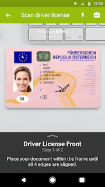
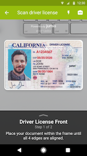
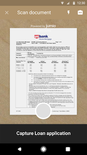

<<<<<<< HEAD
# Plugin for React Native

Official Jumio Mobile SDK plugin for React Native

## Compatibility

We only ensure compatibility with a minimum React Native version of 0.61.4

## Setup

Create React Native project and add the Jumio Mobile SDK module to it.

```sh
react-native init MyProject
cd MyProject
npm install --save https://github.com/Jumio/mobile-react.git#v3.7.1
```

## Integration

### iOS

1. Add the "**NSCameraUsageDescription**"-key to your Info.plist file.

### Android

1. Open your AndroidManifest.xml file and change allowBackup to false.

```xml
<application
...
android:allowBackup="false">
...
</application>
```

2. Make sure your compileSdkVersion and buildToolsVersion are high enough.

```groovy
android {
  compileSdkVersion 29
  buildToolsVersion "29.0.3"
  ...
}
```

3. Enable MultiDex
Follow the Android developers guide: https://developer.android.com/studio/build/multidex.html

```groovy
android {
  ...
  defaultConfig {
    ...
    multiDexEnabled true
  }
}
```

4. Add the Jumio Mobile SDK repository

```groovy
repositories {  
  maven { url 'http://mobile-sdk.jumio.com' }
}
```

## Usage

1. Add "**NativeModules**" to the import of 'react-native'.

```javascript
import {
  ...
  NativeModules
} from 'react-native';
```

2. Create a variable of your iOS module:

```javascript
const { JumioMobileSDKNetverify } = NativeModules;
const { JumioMobileSDKAuthentication } = NativeModules;
const { JumioMobileSDKBamCheckout } = NativeModules;
const { JumioMobileSDKDocumentVerification } = NativeModules;
```

3. The SDKs can be initialized with the following calls.

```javascript
JumioMobileSDKNetverify.initNetverify(<API_TOKEN>, <API_SECRET>, <DATACENTER>, {configuration});
JumioMobileSDKAuthentication.initAuthentication(<API_TOKEN>, <API_SECRET>, <DATACENTER>, {configuration});
JumioMobileSDKDocumentVerification.initDocumentVerification(<API_TOKEN>, <API_SECRET>, <DATACENTER>, {configuration});
JumioMobileSDKBamCheckout.initBAM(<API_TOKEN>, <API_SECRET>, <DATACENTER>, {configuration});
```

Datacenter can either be **us** or **eu**.

## Usage

### Netverify / Fastfill

To initialize the SDK, perform the following call.

```javascript
JumioMobileSDKNetverify.initNetverify(<API_TOKEN>, <API_SECRET>, <DATACENTER>, {configuration});
```

Datacenter can either be **US** or **EU**.


Configure the SDK with the *configuration*-Object.

| Configuration | Datatype | Description |
| ------ | -------- | ----------- |
| enableVerification | Boolean | Enable ID verification |
| callbackUrl | String | Specify an URL for individual transactions |
| enableIdentityVerification | Boolean | Enable face match during the ID verification for a specific transaction |
| preselectedCountry | Boolean | Specify the issuing country (ISO 3166-1 alpha-3 country code) |
| customerInternalReference | String | Allows you to identify the scan (max. 100 characters) |
| reportingCriteria | String | Use this option to identify the scan in your reports (max. 100 characters) |
| userReference | String | Set a customer identifier (max. 100 characters) |
| sendDebugInfoToJumio | Boolean | Send debug information to Jumio. |
| dataExtractionOnMobileOnly | Boolean | Limit data extraction to be done on device only |
| cameraPosition | String | Which camera is used by default. Can be **FRONT** or **BACK**. |
| preselectedDocumentVariant | String | Which types of document variants are available. Can be **PAPER** or **PLASTIC** |
| documentTypes | String-Array | An array of accepted document types: Available document types: **PASSPORT**, **DRIVER_LICENSE**, **IDENTITY_CARD**, **VISA** |
| enableWatchlistScreening | String | Enables [Jumio Screening](https://www.jumio.com/screening/). Can be **ENABLED**, **DISABLED** or **DEFAULT** (when not specified reverts to **DEFAULT**) |
| watchlistSearchProfile | String | Specifies specific profile of watchlist |

Initialization example with configuration.

```javascript
JumioMobileSDKNetverify.initNetverify("API_TOKEN", "API_SECRET", "US", {
  enableVerification: true,
  enableIdentityVerification: true,
  userReference: "CUSTOMERID",
  preselectedCountry: "USA",
  cameraPosition: "BACK",
  documentTypes: ["DRIVER_LICENSE", "PASSPORT", "IDENTITY_CARD", "VISA"],
  enableWatchlistScreening: "ENABLED",
  watchlistSearchProfile: "YOURPROFILENAME"
});
```

***Android eMRTD scanning***

If you are using eMRTD scanning, following lines are needed in your Manifest file:

```javascript
-keep class net.sf.scuba.smartcards.IsoDepCardService {*;}
-keep class org.jmrtd.** { *; }
-keep class net.sf.scuba.** {*;}
-keep class org.bouncycastle.** {*;}
-keep class org.ejbca.** {*;}

-dontwarn java.nio.**
-dontwarn org.codehaus.**
-dontwarn org.ejbca.**
-dontwarn org.bouncycastle.**
```

Add the needed dependencies following [this chapter](https://github.com/Jumio/mobile-sdk-android/blob/master/docs/integration_netverify-fastfill.md#dependencies) of the android integration guide.

Enable eMRTD by using the following method in your native android code:

```javascript
netverifySDK.setEnableEMRTD(true);
```


As soon as the sdk is initialized, the sdk is started by the following call.

```javascript
  JumioMobileSDKNetverify.startNetverify();
```

### Authentication

To initialize and start the SDK, perform the following call.

```javascript
JumioMobileSDKAuthentication.initAuthentication(<API_TOKEN>, <API_SECRET>, <DATACENTER>, {configuration});
```

Datacenter can either be **US** or **EU**.

Configure the SDK with the *configuration*-Object. **(configuration marked with * are mandatory)**

In order to connect the Authentication transaction to a specific Netverify user identity the parameter `enrollmentTransactionReference` must be set. In case an Authentication transaction has been created via the facemap server to server API `authenticationTransactionReference` should be used. Therefore `enrollmentTransactionReference` should not be set.

| Configuration | Datatype | Description |
| ------ | -------- | ----------- |
| **enrollmentTransactionReference*** | String | The reference of the enrollment scan to authenticate for |
| **authenticationTransactionReference*** | String | The reference of the authentication scan to authenticate for |
| **userReference*** | String | Set a customer identifier (max. 100 characters) |

Initialization example with configuration:

```javascript
const startAuthentication = () => {
  JumioMobileSDKAuthentication.initAuthentication('API_TOKEN', 'API_SECRET', 'US', {
    enrollmentTransactionReference: "EnrollmentTransactionReference",
    //authenticationTransactionReference: "AuthenticationTransactionReference",
    userReference: "UserReference"
    callbackUrl: "URL"
  });  
};
```

As soon as the sdk is initialized, the sdk is started by the following call.

```javascript
JumioMobileSDKNetverify.startAuthentication();
```

### Document Verification

To initialize the SDK, perform the following call.

```javascript
JumioMobileSDKDocumentVerification.initDocumentVerification(<API_TOKEN>, <API_SECRET>, <DATACENTER>, {configuration});
```

Datacenter can either be **US** or **EU**.

Configure the SDK with the *configuration*-Object. **(configuration marked with * are mandatory)**

| Configuration | Datatype | Description |
| ------ | -------- | ----------- |
| **type*** | String | See the list below |
| **userReference*** | String | Set a customer identifier (max. 100 characters) |
| **country*** | String | Set the country (ISO-3166-1 alpha-3 code) |
| **customerInternalReference*** | String | Allows you to identify the scan (max. 100 characters) |
| reportingCriteria | String | Use this option to identify the scan in your reports (max. 100 characters) |
| callbackUrl | String | Specify an URL for individual transactions |
| documentName | String | Override the document label on the help screen |
| customDocumentCode | String | Set your custom document code (set in the merchant backend under "Settings" - "Multi Documents" - "Custom" |
| cameraPosition | String | Which camera is used by default. Can be **FRONT** or **BACK**. |

Possible types:

*  BS (Bank statement)
*  IC (Insurance card)
*  UB (Utility bill, front side)
*  CAAP (Cash advance application)
*  CRC (Corporate resolution certificate)
*  CCS (Credit card statement)
*  LAG (Lease agreement)
*  LOAP (Loan application)
*  MOAP (Mortgage application)
*  TR (Tax return)
*  VT (Vehicle title)
*  VC (Voided check)
*  STUC (Student card)
*  HCC (Health care card)
*  CB (Council bill)
*  SENC (Seniors card)
*  MEDC (Medicare card)
*  BC (Birth certificate)
*  WWCC (Working with children check)
*  SS (Superannuation statement)
*  TAC (Trade association card)
*  SEL (School enrolment letter)
*  PB (Phone bill)
*  USSS (US social security card)
*  SSC (Social security card)
*  CUSTOM (Custom document type)

Initialization example with configuration.

```javascript
JumioMobileSDKDocumentVerification.initDocumentVerification("API_TOKEN", "API_SECRET", "US", {
  type: "BC",
  userReference: "CUSTOMER ID",
  country: "USA",
  customerInternalReference: "YOURSCANREFERENCE",
  cameraPosition: "BACK"
});
```

As soon as the sdk is initialized, the sdk is started by the following call.

```javascript
JumioMobileSDKDocumentVerification.startDocumentVerification();
```

### BAM Checkout

To Initialize the SDK, perform the following call.

```javascript
JumioMobileSDKBamCheckout.initBAM(<API_TOKEN>, <API_SECRET>, <DATACENTER>, {configuration});
```

Datacenter can either be **US** or **EU**.

Configure the SDK with the *configuration*-Object.

| Configuration | Datatype | Description |
| ------ | -------- | ----------- |
| cardHolderNameRequired | Boolean |
| sortCodeAndAccountNumberRequired | Boolean |
| expiryRequired | Boolean |
| cvvRequired | Boolean |
| expiryEditable | Boolean |
| cardHolderNameEditable | Boolean |
| reportingCriteria | String | Overwrite your specified reporting criteria to identify each scan attempt in your reports (max. 100 characters)
| vibrationEffectEnabled | Boolean |
| enableFlashOnScanStart | Boolean |
| cardNumberMaskingEnabled | Boolean |
| offlineToken | String | In your Jumio merchant backend on the "Settings" page under "API credentials" you can find your Offline token. In case you use your offline token, you must not set the API token and secret|
| cameraPosition | String | Which camera is used by default. Can be **FRONT** or **BACK**. |
| cardTypes | String-Array | An array of accepted card types. Available card types: **VISA**, **MASTER_CARD**, **AMERICAN_EXPRESS**, **CHINA_UNIONPAY**, **DINERS_CLUB**, **DISCOVER**, **JCB** |

Initialization example with configuration.

```javascript
JumioMobileSDKBamCheckout.initBAM("API_TOKEN", "API_SECRET", "US", {
  cardHolderNameRequired: false,
  cvvRequired: true,
  cameraPosition: "BACK",
  cardTypes: ["VISA", "MASTER_CARD"]
});
```


As soon as the sdk is initialized, the sdk is started by the following call.

```javascript
JumioMobileSDKBamCheckout.startBAM();
```

### Offline scanning

If you want to use Fastfill in offline mode please contact Jumio Customer Service at support@jumio.com or https://support.jumio.com. Once this feature is enabled for your account, you can find your offline token in your Jumio customer portal on the "Settings" page under "API credentials".

**iOS**

Pass your offline token to your configuration object of BAM Checkout.

```javascript
offlineToken: "TOKEN",
```

**Android**

Offline scanning not supported yet.

### Android Netverify eMRTD

Use `enableEMRTD` to read the NFC chip of an eMRTD.

```javascript
JumioMobileSDKNetverify.enableEMRTD();
```

### Retrieving information

You can listen to events to retrieve the scanned data:

* **EventDocumentData** for Netverify results.
* **EventErrorNetverify** for Netverify error.

* **EventAuthentication** for Authentication results
* **EventErrorAuthentication** for Authentication error.

* **EventDocumentVerification** for Document Verification results.
* **EventErrorDocumentVerification** for Document Verification error.

* **EventCardInformation** for BAM results.
* **EventErrorBam** for BAM error.

First add **NativeEventEmitter** to the import from 'react-native' and listen to the events.

```javascript
import {
...
NativeEventEmitter
} from 'react-native';
```

The event receives a json object with all the data.
The example below shows how to retrieve the information of each emitter as a String:

```javascript
const emitterNetverify = new NativeEventEmitter(JumioMobileSDKNetverify);
emitterNetverify.addListener(
  'EventDocumentData',
  (EventDocumentData) => console.warn("EventDocumentData: " + JSON.stringify(EventDocumentData))
);
emitterNetverify.addListener(
  'EventErrorNetverify',
  (EventErrorNetverify) => console.warn("EventErrorNetverify: " + JSON.stringify(EventErrorNetverify))
);

const emitterAuthentication = new NativeEventEmitter(JumioMobileSDKAuthentication);
  emitterAuthentication.addListener(
  'EventAuthentication',
  (EventAuthentication) => console.warn("EventAuthentication: " + JSON.stringify(EventAuthentication))
);
emitterAuthentication.addListener(
  'EventErrorAuthentication',
  (EventErrorAuthentication) => console.warn("EventErrorAuthentication: " + JSON.stringify(EventErrorAuthentication))
);

const emitterDocumentVerification = new NativeEventEmitter(JumioMobileSDKDocumentVerification)
emitterDocumentVerification.addListener(
  'EventDocumentVerification',
  (EventDocumentVerification) => console.warn("EventDocumentVerification: " + JSON.stringify(EventDocumentVerification))
);
emitterDocumentVerification.addListener(
  'EventDocumentVerification',
  (EventDocumentVerification) => console.warn("EventDocumentVerification: " + JSON.stringify(EventDocumentVerification))
);

const emitterBamCheckout = new NativeEventEmitter(JumioMobileSDKBamCheckout)
emitterBamCheckout.addListener(
  'EventCardInformation',
  (EventCardInformation) => console.warn("EventCardInformation: " + JSON.stringify(EventCardInformation))
);
emitterBamCheckout.addListener(
  'EventErrorBam',
  (EventErrorBam) => console.warn("EventErrorBam: " + JSON.stringify(EventErrorBam))
);
```

## Customization

### Android

#### Netverify
The Netverify SDK can be customized to the respective needs by following this [customization chapter](https://github.com/Jumio/mobile-sdk-android/blob/v3.7.2/docs/integration_netverify-fastfill.md#customization).

#### Authentication
The Authentication SDK can be customized to the respective needs by following this [customization chapter](https://github.com/Jumio/mobile-sdk-android/blob/v3.7.2/docs/integration_authentication.md#customization).

#### BAM Checkout
The BAM Checkout SDK can be customized to the respective needs by following this [customization chapter](https://github.com/Jumio/mobile-sdk-android/blob/v3.7.2/docs/integration_bam-checkout.md#customization).

#### Document Verification
The Document Verification SDK can be customized to the respective needs by following this [customization chapter](https://github.com/Jumio/mobile-sdk-android/blob/v3.7.2/docs/integration_document-verification.md#customization).


### iOS

The SDK can be customized to the respective needs by using the following initializers instead.
```javascript
JumioMobileSDKNetverify.initNetverifyWithCustomization(<API_TOKEN>, <API_SECRET>, <DATACENTER>, {configuration}, {customization});
JumioMobileSDKDocumentVerification.initDocumentVerificationWithCustomization(<API_TOKEN>, <API_SECRET>, <DATACENTER>, {configuration}, {customization});
JumioMobileSDKBamCheckout.initBAMWithCustomization(<API_TOKEN>, <API_SECRET>, <DATACENTER>, {configuration}, {customization});
JumioMobileSDKAuthentication.initAuthenticationWithCustomization(<API_TOKEN>, <API_SECRET>, <DATACENTER>, {configuration}, {customization});
```

You can pass the following customization options to the initializer:

| Customization key | Type | Description |
|:------------------|:-----|:------------|
| disableBlur       | BOOL | Deactivate the blur effect |
| backgroundColor   | STRING | Change base view's background color |
| foregroundColor   | STRING | Change base view's foreground color |
| tintColor         | STRING | Change the tint color of the navigation bar |
| barTintColor      | STRING | Change the bar tint color of the navigation bar |
| textTitleColor    | STRING | Change the text title color of the navigation bar |
| documentSelectionHeaderBackgroundColor | STRING | Change the background color of the document selection header |
| documentSelectionHeaderTitleColor | STRING | Change the title color of the document selection header |
| documentSelectionHeaderIconColor | STRING | Change the icon color of the document selection header |
| documentSelectionButtonBackgroundColor | STRING | Change the background color of the document selection button |
| documentSelectionButtonTitleColor | STRING | Change the title color of the document selection button |
| documentSelectionButtonIconColor | STRING | Change the icon color of the document selection button |
| fallbackButtonBackgroundColor | STRING | Change the background color of the fallback button |
| fallbackButtonBorderColor | STRING | Change the border color of the fallback button |
| fallbackButtonTitleColor | STRING | Change the title color of the fallback button |
| positiveButtonBackgroundColor | STRING | Change the background color of the positive button |
| positiveButtonBorderColor | STRING | Change the border color of the positive button |
| positiveButtonTitleColor | STRING | Change the title color of the positive button |
| negativeButtonBackgroundColor | STRING | Change the background color of the negative button |
| negativeButtonBorderColor | STRING | Change the border color of the negative button |
| negativeButtonTitleColor | STRING | Change the title color of the negative button |
| scanOverlayStandardColor (NV only) | STRING | Change the standard color of the scan overlay |
| scanOverlayValidColor (NV only) | STRING | Change the valid color of the scan overlay |
| scanOverlayInvalidColor (NV only) | STRING | Change the invalid color of the scan overlay |
| scanOverlayTextColor (BAM only) | STRING | Change the text color of the scan overlay |
| scanOverlayBorderColor (BAM only) | STRING | Change the border color of the scan overlay |

All colors are provided with a HEX string with the following format: #ff00ff.

**Customization example**

```javascript
JumioMobileSDKNetverify.initNetverifyWithCustomization("API_TOKEN", "API_SECRET", "US", {
  enableVerification: false,
  ...
}, {
  disableBlur: true,
  backgroundColor: "#ff00ff",
  barTintColor: "#ff1298"
);
```

## Callbacks

To get information about callbacks, Netverify Retrieval API, Netverify Delete API and Global Netverify settings and more, please read our [page with server related information](https://github.com/Jumio/implementation-guides/blob/master/netverify/callback.md).

The JSONObject with all the extracted data that is returned for the specific products is described in the following subchapters:

### Netverify & Fastfill

*NetverifyDocumentData:*

| Parameter | Type | Max. length | Description  |
|:-------------------|:-----------     |:-------------|:-----------------|
| selectedCountry | String| 3| [ISO 3166-1 alpha-3](http://en.wikipedia.org/wiki/ISO_3166-1_alpha-3) country code as provided or selected |
| selectedDocumentType | String | 16| PASSPORT, DRIVER_LICENSE, IDENTITY_CARD or VISA |
| idNumber | String | 100 | Identification number of the document |
| personalNumber | String | 14| Personal number of the document|
| issuingDate | Date | | Date of issue |
| expiryDate | Date | | Date of expiry |
| issuingCountry | String | 3 | Country of issue as ([ISO 3166-1 alpha-3](https://en.wikipedia.org/wiki/ISO_3166-1_alpha-3)) country code |
| lastName | String | 100 | Last name of the customer|
| firstName | String | 100 | First name of the customer|
| dob | Date | | Date of birth |
| gender | String | 1| m, f or x |
| originatingCountry | String | 3|Country of origin as ([ISO 3166-1 alpha-3](https://en.wikipedia.org/wiki/ISO_3166-1_alpha-3)) country code |
| addressLine | String | 64 | Street name    |
| city | String | 64 | City |
| subdivision | String | 3 | Last three characters of [ISO 3166-2:US](http://en.wikipedia.org/wiki/ISO_3166-2:US) state code    |
| postCode | String | 15 | Postal code |
| mrzData |  MRZ-DATA | | MRZ data, see table below |
| optionalData1 | String | 50 | Optional field of MRZ line 1 |
| optionalData2 | String | 50 | Optional field of MRZ line 2 |
| placeOfBirth | String | 255 | Place of Birth |
| extractionMethod | String | 12| MRZ, OCR, BARCODE, BARCODE_OCR or NONE |

*MRZ-Data*

| Parameter |Type | Max. length | Description |
|:---------------|:------------- |:-------------|:-----------------|
| format | String |  8| MRP, TD1, TD2, CNIS, MRVA, MRVB or UNKNOWN |
| line1 | String | 50 | MRZ line 1 |
| line2 | String | 50 | MRZ line 2 |
| line3 | String | 50| MRZ line 3 |
| idNumberValid | BOOL| | True if ID number check digit is valid, otherwise false |
| dobValid | BOOL | | True if date of birth check digit is valid, otherwise false |
| expiryDateValid |    BOOL| |    True if date of expiry check digit is valid or not available, otherwise false|
| personalNumberValid | BOOL | | True if personal number check digit is valid or not available, otherwise false |
| compositeValid | BOOL | | True if composite check digit is valid, otherwise false |


### Authentication

*AuthenticationResult:*

| Parameter |Type | Max. length | Description |
|:---------------|:------------- |:-------------|:-----------------|
| authenticationResult | String |  8| SUCCESS or FAILED |

### BAM Checkout

*BAMCardInformation:*

|Parameter | Type | Max. length | Description |
|:----------------------------     |:-------------|:-----------------|:-------------|
| cardType | String |  16| VISA, MASTER_CARD, AMERICAN_EXPRESS, CHINA_UNIONPAY, DINERS_CLUB, DISCOVER, JCB or STARBUCKS |
| cardNumber | String | 16 | Full credit card number |
| cardNumberGrouped | String | 19 | Grouped credit card number |
| cardNumberMasked | String | 19 | First 6 and last 4 digits of the grouped credit card number, other digits are masked with "X" |
| cardExpiryMonth | String | 2 | Month card expires if enabled and readable |
| CardExpiryYear | String | 2 | Year card expires if enabled and readable |
| cardExpiryDate | String | 5 | Date card expires in the format MM/yy if enabled and readable |
| cardCVV | String | 4 | Entered CVV if enabled |
| cardHolderName | String | 100 | Name of the card holder in capital letters if enabled and readable, or as entered if editable |
| cardSortCode | String | 8 | Sort code in the format xx-xx-xx or xxxxxx if enabled, available and readable |
| cardAccountNumber | String | 8 | Account number if enabled, available and readable |
| cardSortCodeValid | BOOL |  | True if sort code valid, otherwise false |
| cardAccountNumberValid | BOOL |  | True if account number code valid, otherwise false |

### Document Verification

No data returned.

# Support

## Contact

If you have any questions regarding our implementation guide please contact Jumio Customer Service at support@jumio.com or https://support.jumio.com. The Jumio online helpdesk contains a wealth of information regarding our service including demo videos, product descriptions, FAQs and other things that may help to get you started with Jumio. Check it out at: https://support.jumio.com.

## Licenses
The software contains third-party open source software. For more information, please see [Android licenses](https://github.com/Jumio/mobile-sdk-android/tree/master/licenses) and [iOS licenses](https://github.com/Jumio/mobile-sdk-ios/tree/master/licenses)

This software is based in part on the work of the Independent JPEG Group.

## Copyright
&copy; Jumio Corp. 268 Lambert Avenue, Palo Alto, CA 94306
=======


[](#release-notes)
[](#copyright)
[](#general-requirements)
[](#integration)
[](#general-requirements)

# Table of Contents
- [Overview](#overview)
- [Get Started](#get-started)
    - [ID Verification & Fastfill SDK](docs/integration_id-verification-fastfill.md)
    - [Authentication SDK](docs/integration_authentication.md)
    - [Document Verification SDK](docs/integration_document-verification.md)
    - [BAM Checkout SDK](docs/integration_bam-checkout.md)
- [Quickstart](#quickstart)
- [Basics](#basics)
    - [General Requirements](#general-requirements)
    - [Permissions](#permissions)
    - [Integration](#integration)
    - [Proguard](#proguard)
    - [Language Localization](#language-localization)
- [Security](#security)
- [Release Notes](#release-notes)
- [Support](#support)
- [Javadoc](https://jumio.github.io/mobile-sdk-android/)
- [FAQ](docs/integration_faq.md)
- [Known Issues](docs/known_issues.md)

# Overview
The Jumio Software Development Kit (SDK) provides you with a set of tools and UIs (default or custom) to develop an Android application perfectly fitted to your specific needs.

Onboard new users and easily verify their digital identities by making sure the IDs they provide are valid and authentic. Extract data from IDs and credit cards completely automatically and within seconds. Confirm that users really are who they say they are by having them take a quick selfie and match it to their respective documents. Jumio uses cutting-edge biometric technology such as 3D face mapping to make sure there is an actual, real-life person in front of the screen.

    

Using the Jumio SDK will allow you to create the best possible solution for your individual needs, providing you with a range of different services to choose from.

# Get Started
Please note that [basic setup](#basics) is required before continuing with the integration of any of the following services.

## Jumio ID Verification & Fastfill
ID Verification (formerly known as Netverify) is a secure and easy solution that allows you to establish the genuine identity of your users in your mobile application by verifying their passports and other government-issued IDs in real time. Very user-friendly and highly customizable, it makes onboarding new customers quick and simple.

- [Integration ID Verification & Fastfill SDK](docs/integration_id-verification-fastfill.md)

## Jumio Authentication
Authentication is a cutting-edge, biometric-based service that establishes digital identities of your users simply by taking a selfie. Advanced 3D face-mapping technology quickly and securely authenticates users and their digital identities.

- [Integration Authentication SDK](docs/integration_authentication.md)

## Jumio Document Verification
Document Verification is a powerful solution that allows users to scan various types of documents quickly and easily in your mobile application. Data extraction is already supported for various document types, such as bank statements.

- [Integration Document Verification SDK](docs/integration_document-verification.md)

## Jumio BAM Checkout
BAM Checkout enables you to extract data from your customer's credit card and/or ID in your mobile application within seconds. Every checkout flow is fully automated, with no manual input necessary!

- [Integration BAM Checkout SDK](docs/integration_bam-checkout.md)

# Quickstart
This section provides a quick overview of getting started with the [Android sample application](sample) that can be found here on Github. You will need a __commercial Jumio License__ to successfully run any of our examples; for details, contact sales@jumio.com. You will also need a current Android Studio version to open and try out the sample project.

Start by downloading the [Android sample application](sample) from the Jumio Github repo. You can either clone the repository (using SSH or HTTPS) to your local device or simply download everything as a ZIP.

Once you’ve got the sample application downloaded and unzipped, open Android Studio. Choose __Import project__ and navigate to where you’ve saved your sample application. Select the __JumioMobileSample folder__ and open it.

Android Studio will now start to import the project. This might take a bit of time. Make sure to wait until the Gradle Build has finished and the application is properly installed!

The Android sample application contains the packages `com.jumio.sample.java` and `com.jumio.sample.kotlin`. These packages contain the same sample but in Java and Kotlin respectively. If you'd like to switch between them, you'll have to switch the `<intent-filter>` in the `AndroidManifest.xml` from one `MainActivity` to the other. By default, the filter is set for Kotlin:

```
<!-- KOTLIN -->
<activity
    android:name="com.jumio.sample.kotlin.MainActivity"
    android:configChanges="orientation|screenSize|screenLayout|keyboardHidden|uiMode|layoutDirection"
    android:label="@string/app_name"
    android:theme="@style/AppTheme">

    <intent-filter>
        <action android:name="android.intent.action.MAIN"/>
        <category android:name="android.intent.category.LAUNCHER"/>
    </intent-filter>

</activity>
```

Both the Java and Kotlin packages contain:
* `MainActivity`
* `authentication`
* `bam`
* `document-verification`
* `netverify`
    * `customui`

Each of these folders contains a corresponding fragment. In each fragment, the most important methods for this service are shown and quickly outlined. If you’re interested in seeing how the ID Verification Custom UI works, check out the `customui` folder inside `netverify`, which shows an example of how a custom implementation could be done and what it could look like.

Right at the top of the `MainActivity` you’ll find the following empty parameters:

`private static String NETVERIFY_API_TOKEN`
`private static String NETVERIFY_API_SECRET`

If you haven’t done so yet, log into your Jumio Customer Portal. You can find your customer API token and API secret on the __Settings__ page under the __API credentials__ tab. Add your individual key and token instead of the placeholder `""`. The default setting for the data center is `JumioDataCenter.US`. If you're using [BAM Checkout](docs/integration_bam-checkout.md), you'll need to use the BAM API token and BAM API secret.

__Note:__ We strongly recommend storing all credentials outside of your app! We suggest not to hardcode them within your application but to load them during runtime from your server-side implementation.

Once you start up the sample application, you'll be given the option of trying out ID Verification. Click the hamburger menu in the top left corner to try out something else. Your application will also need camera permissions, which will be prompted for automatically once you try to start any of the services. If you deny camera permissions, you won't be able to use any of the services.

### Tutorials
The following tutorials show you how to get started and the fundamentals of using the SDK:
* [Getting started (Video):](https://share.vidyard.com/watch/oAUXU1EWXco1mPUePz7Ue6) How to clone the repository and configure your Jumio credentials
* [Introduction (Video):](https://share.vidyard.com/watch/nqUmPAaqG4bMy4Wh5wb9Kn) How to initialize the SDK, run the sample on your Android device, and test the identity verification user journey
* [Configuring behavior (Video):](https://share.vidyard.com/watch/BPT2jB51oUgkvRaAuKVb3q) How to configure the behavior of the app using SDK parameters
* [Customizing appearance (Video):](https://share.vidyard.com/watch/rEkMfyhjRXb1G7ffYUioLK) How to customize the look and feel of your application using the Jumio Surface tool

# Basics

## General Requirements
The minimum requirements for the SDK are:
*	Android 4.4 (API level 19) or higher
*	Internet connection

The following architectures are supported in the SDK:
*	ARMv7 processor with Neon
*	ARM64-v8a

__Note:__ Currently, x86 and x86_64 are *not* supported. You get an *UnsatisfiedLinkError* if app and CPU architecture do not match or the CPU architecture is not supported.

You will need a __commercial Jumio License__ to run any of our examples. For details, contact sales@jumio.com.

## Permissions
Required permissions are linked automatically by the SDK.

The following permissions are optional:
```
<uses-permission android:name="android.permission.VIBRATE"/>
<uses-feature android:name="android.hardware.camera" android:required="false"/>
```

__Note:__ On devices running Android Marshmallow (6.0) and above, you need to acquire `android.permissions.CAMERA` dynamically before initializing the SDK.

Use `getRequiredPermissions()` to get a list of all required permissions.
```
public static String[] getRequiredPermissions();
```

## Integration
Use the SDK in your application by including the Maven repositories with the following `build.gradle` configuration in Android Studio:

```
repositories {
	google()
	jcenter()
	maven { url 'https://mobile-sdk.jumio.com' }
}
```
Check the Android Studio [sample projects](sample/JumioMobileSample/) to learn the most common use.


## Proguard
The following Proguard keep rules have to be added to the Jumio Mobile SDK:
```
-keep class com.jumio.** { *; }
-keep public class com.iproov.sdk.IProov {public *; }
```
Most of the Proguard settings are applied automatically as they are defined as consumer Proguard rules within the SDK. The current rules can also be found in the [Sample app](sample/JumioMobileSample/).

## Language Localization
Our SDK supports the [default Android localization features](https://developer.android.com/training/basics/supporting-devices/languages.html) for different languages. All label texts and button titles in the SDK can be changed and localized by adding the required Strings you want to change in a `strings.xml` file in a `values` directory for the language and culture preference that you want to support. You can check out strings that are modifiable [within our Sample application](sample/JumioMobileSample/src/main/res/values/strings-jumio-sdk.xml).

For the ID Verification, Fastfill, Authentication, and Document Verification products we support the following languages:

_Afrikaans, Arabic, Bulgarian, Chinese(Simplified), Chinese(Traditional), Croatian, Czech, Danish, Dutch, Estonian, English, Finnish, French, German, Greek, Hindi, Hungarian, Indonesian, Italian, Japanese, Khmer, Korean, Latvian, Lithuanian, Maltese, Norwegian, Polish, Portuguese, Romanian, Russian, Slovak, Slovenian, Spanish, Swedish, Thai, Turkish, Vietnamese, Zulu_

Our SDK supports accessibility features. Visually impaired users can now enable __TalkBack__ or increase the __text size__ on their device. The accessibility strings that are used by TalkBack contain *accessibility* in their key and can be also modified in `strings.xml`.

# Security
All SDK related traffic is sent over HTTPS using TLS and public key pinning. Additionally, the information itself within the transmission is also encrypted utilizing __Application Layer Encryption__ (ALE). ALE is a Jumio custom-designed security protocol that utilizes RSA-OAEP and AES-256 to ensure that the data cannot be read or manipulated even if the traffic was captured.

# Release Notes
See our [Change Log](docs/changelog.md) for more information about our current SDK version and further details.

# Support

## Previous Version
The previous release version 3.8.0 of the Jumio Mobile SDK is supported until 2021-06-05.

When the support period has expired, bug fixes and technical support will no longer be provided. Current bugs are typically fixed in the upcoming versions. Older SDK versions will keep functioning with our server until further notice, but we highly recommend that you always update to the latest version to benefit from SDK improvements and bug fixes.

## Two-factor Authentication
If you want to enable two-factor authentication for your Jumio Customer Portal, [contact us](https://support.jumio.com). Once enabled, users will be guided through the setup upon their first login to obtain a security code using the Google Authenticator app.

## Licenses
The software contains third-party open source software. For more information, see [licenses](licenses).

This software is based in part on the work of the Independent JPEG Group.

## Contact
If you have any questions regarding our implementation guide please contact Jumio Customer Service at support@jumio.com. The [Jumio online helpdesk](https://support.jumio.com) contains a wealth of information regarding our services including demo videos, product descriptions, FAQs, and other resources that can help to get you started with Jumio.

## Copyright
&copy; Jumio Corporation, 395 Page Mill Road, Suite 150, Palo Alto, CA 94306
>>>>>>> master

The source code and software available on this website (“Software”) is provided by Jumio Corp. or its affiliated group companies (“Jumio”) "as is” and any express or implied warranties, including, but not limited to, the implied warranties of merchantability and fitness for a particular purpose are disclaimed. In no event shall Jumio be liable for any direct, indirect, incidental, special, exemplary, or consequential damages (including but not limited to procurement of substitute goods or services, loss of use, data, profits, or business interruption) however caused and on any theory of liability, whether in contract, strict liability, or tort (including negligence or otherwise) arising in any way out of the use of this Software, even if advised of the possibility of such damage.
In any case, your use of this Software is subject to the terms and conditions that apply to your contractual relationship with Jumio. As regards Jumio’s privacy practices, please see our privacy notice available here: [Privacy Policy](https://www.jumio.com/legal-information/privacy-policy/).
